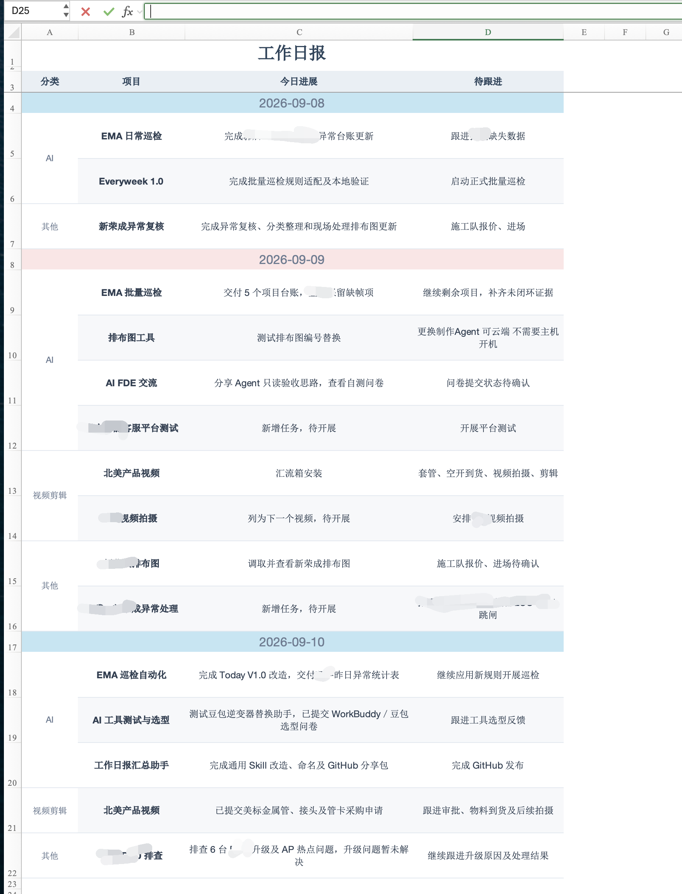
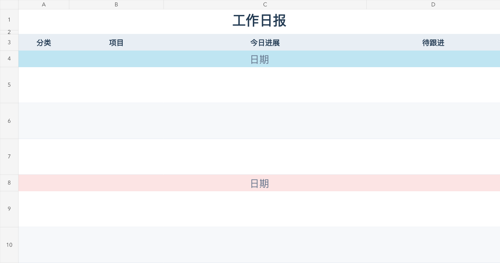

# 工作日报汇总助手

面向 ChatGPT Pro 用户的工作日报 Skill，从电脑历史发现工作、核实进展，并生成简报与按日期累计的 Excel



*使用者提供的实际日报截图，部分信息已遮盖，仅供效果展示*

**电脑历史发现工作 → 核实实际进展 → 按项目归并 → 一句话确认 → 输出日报**

版本：1.0.0 · Skill 标识：`workday-report-summary-assistant`

## 能做什么

- 将表格、浏览器、文档等软件中围绕同一项目的活动合并成简洁工作描述
- 区分查看、修改、提交、交付与办结，避免把计划或尝试写成完成
- 对不明确的状态集中做“一句话确认”，记录确认日期，减少重复追问
- 按固定四栏模板生成 Excel，保留历史日期，同一天重复运行不重复追加
- 由每位使用者定义工作范围、分类、时区及保存位置，支持按需设置定时生成

## 使用前提

- ChatGPT Pro 用户，使用 macOS 桌面端
- 已启用 Computer History 和 Memories，并允许记录相关工作应用
- 当前工作环境能读取上述历史，并能使用本地 Skill 与表格生成工具

Skill 不会替用户开通套餐、开启电脑记录或设置自动任务。具体可用性以当前客户端和账号权限为准，参见 [Computer History 官方说明](https://learn.chatgpt.com/docs/customization/computer-history)

## 安装与开始

下载并解压本仓库，保留整个 `workday-report-summary-assistant` 文件夹，包括模板、脚本和参考文件

在支持本地 Skill 的 Codex 桌面工作环境中，将文件夹交给助手并说：

> 请安装这个“工作日报汇总助手” Skill，保留其中的模板和脚本

若使用者的 ChatGPT 界面采用插件分发，按 [官方插件说明](https://learn.chatgpt.com/docs/build-plugins) 将此 Skill 封装导入。本仓库提供 Skill 源文件，尚未上架公共插件目录

首次使用时说明工作范围及分类，例如：

> 请使用 $workday-report-summary-assistant 整理我今天的工作。我主要负责项目管理，按项目推进、沟通协作、其他分类，生成日报和累计 Excel，不明确的状态集中让我一句话补充

后续可以直接说：

> 用工作日报汇总助手整理今天的工作

> 方案已经发出，客户反馈还没收到，请更新今天的日报

需要定时生成时，再指定时间、时区及“工作日”或“每天”；未设置定时任务时，由使用者主动调用

## Excel 模板

| 分类 | 项目 | 今日进展 | 待跟进 |
|---|---|---|---|
| 用户自定义 | 业务项目名称 | 有证据的实际进展 | 后续安排或待确认节点 |

- 在同一张工作表按日期累计，保留旧日期的历史内容
- 蓝红日期栏按自然日交替，同一天相同分类合并
- 全部内容水平、垂直居中，冻结前 3 行，正文自动换行
- 用户修改模板后，后续以最新确认版为准



[下载空白 Excel 模板](assets/report-template.xlsx)

## 仓库结构

```text
workday-report-summary-assistant/
├── SKILL.md                        执行规则
├── README.md                       使用说明
├── agents/openai.yaml              显示名称与默认提示
├── assets/report-template.xlsx     空白模板
├── docs/workday-report-example.png 实际日报主图
├── docs/template-preview.png       模板预览
├── scripts/
│   ├── report_data.mjs             日期与历史合并
│   └── render_report.mjs           标准 Excel 生成
└── references/
    ├── configuration.md            个人配置与跟进状态
    ├── workbook.md                 模板规范与脚本使用
    ├── example-report.json         明确标注的虚构示例
    └── platform.md                 平台条件与官方来源
```

普通使用者直接让助手执行 Skill。生成脚本依赖当前环境提供的 `@oai/artifact-tool`；缺少该库时，可用环境已有的表格能力操作同一模板。详细用法见 [Excel 与生成脚本](references/workbook.md)

## 数据与结果

电脑历史用于发现工作线索，直接文件、应用记录和使用者确认用于判断成果。线下工作和记录缺口由使用者补充，不根据记录空白推断当天没有工作

每个人的配置、证据、日报和跟进状态单独保存在其任务目录。仓库包含通用规则、空白模板、虚构示例及使用者授权展示的日报截图；`.gitignore` 排除了常见运行目录与状态文件

## 验证情况

已验证 Skill 结构、历史保留、同日更新与重复执行、日期配色、分类合并、Excel 文件回读及模板渲染

尚未完成真实电脑历史的完整日报试跑，也未做原生 Microsoft Excel 回读。首次实际使用时仍需核对工作内容、记录覆盖范围及待确认事项
